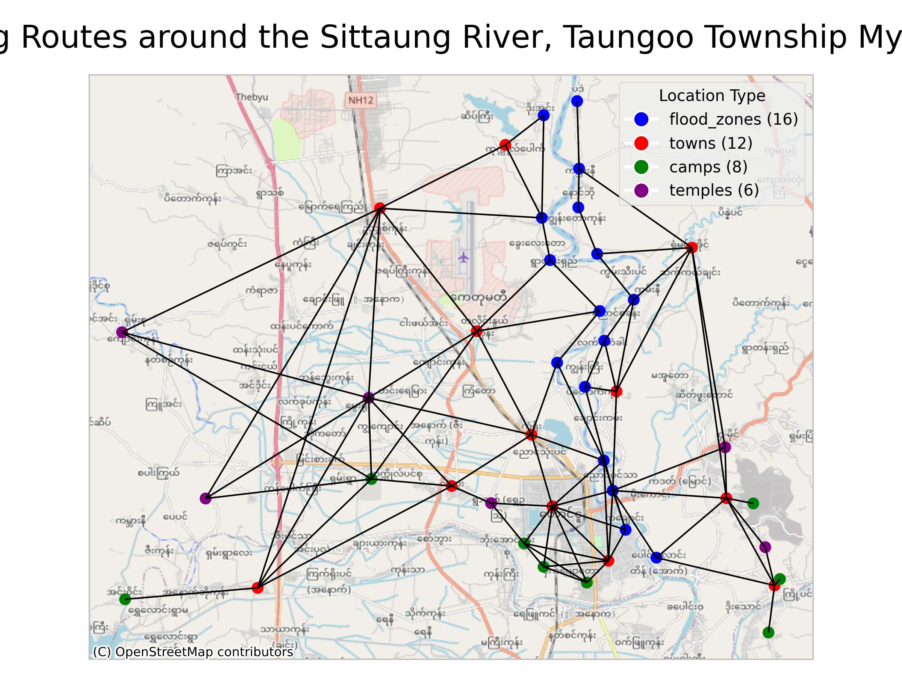

# Myanmar Flood-Induced Population Displacement Simulation

This project simulates forced human displacement due to flooding in the Taungoo region of Myanmar, combining water level classification with agent-based modeling using the FLEE simulation framework.
Hereby the flooding is caused by Typhoon Yagi in September 2024.



## Table of Contents

- [Overview](#overview)
- [Project Structure](#project-structure)
- [Features](#features)
  - [Water Level Analysis](#water-level-analysis)
  - [Geospatial Modeling](#geospatial-modeling)
  - [Displacement Simulation](#displacement-simulation)
  - [Analysis and Visualization](#analysis-and-visualization)
- [Installation](#installation)
- [Usage](#usage)
  - [Quick Start](#quick-start)
  - [Key Functions](#key-functions)
- [Data Sources](#data-sources)
  - [Water Level Data](#water-level-data)
  - [Geographic Data](#geographic-data)
- [Simulation Scenarios](#simulation-scenarios)
- [Output Files](#output-files)
  - [Simulation Results](#simulation-results)
  - [Visualizations](#visualizations)
- [Technical Details](#technical-details)
  - [Dependencies](#dependencies)
  - [Performance Considerations](#performance-considerations)
  - [FLEE](#flee)
- [Contributing](#contributing)
- [License](#license)
- [Contact](#contact)
- [Acknowledgments](#acknowledgments)

## Overview

The simulation models how populations might be displaced during flood events, incorporating real water level data from the Sittaung River at Taungoo station. The project integrates:

- **Water level classification** based on real data from Myanmar's Ministry of Environmental Conservation and Forestry
- **Geospatial analysis** of locations including flood zones, towns, camps, and temples
- **Agent-based displacement modeling** using the FLEE simulation framework
- **Statistical analysis and visualization** of simulation results

## Project Structure

```
Yagi-flood-sim/
├── interface.ipynb             # Main interactive interface for running simulations
├── requirements.txt            # Python dependencies
├── src/                        # Core source code
│   ├── config_file.py          # Configuration settings
│   ├── create_config_files.py  # Generate FLEE simulation config files
│   ├── download_data.py        # Data download utilities
│   ├── get_files.py            # File reading utilities
│   └── water_classification.py # Water level classification logic
├── script/                     # Analysis and plotting scripts
│   ├── calc_statistics.py      # Statistical calculations
│   ├── plot_maps.py            # Map visualization
│   ├── plot_results.py         # Results plotting (heatmaps, time series)
│   └── plot_water.py           # Water level visualization
│   ├── area/                   # Water level and regional data
├── input_data/                 # Input datasets
│   └── geoshapes/              # Geographic shapefiles
├── simulation_results/         # FLEE simulation outputs
├── plots/                      # Generated visualizations
└── .gitignore                  # Git ignore rules
```

## Features

### Water Level Analysis
- **Real-time data integration**: Processes water level data from Myanmar government sources
- **Classification system**: Converts water levels into risk categories (0-5 scale)
- **Danger threshold detection**: Identifies when water levels exceed safe limits
- **Forecasting integration**: Incorporates 24-hour water level forecasts

### Geospatial Modeling
- **Location mapping**: Maps flood zones, towns, refugee camps, and temples
- **Route visualization**: Shows displacement routes between locations
- **Geographic context**: Provides regional context maps with administrative boundaries
- **Coordinate system handling**: Proper projection management for accurate spatial analysis

### Displacement Simulation
- **FLEE integration**: Generates configuration files for the FLEE agent-based model
- **Multiple scenarios**: Supports different refugee population sizes and infrastructure configurations
- **Time-series modeling**: Tracks displacement patterns over time
- **Statistical validation**: Compares simulation results with real-world data

### Analysis and Visualization
- **Error analysis**: Generates heatmaps showing prediction accuracy
- **Statistical summaries**: Calculates means and standard deviations across multiple simulation runs
- **Time-series plots**: Visualizes displacement patterns over time
- **Interactive maps**: Creates detailed route and location visualizations

## Installation

1. **Clone the repository**:
   ```bash
   git clone <repository-url>
   cd clean_code_base
   ```

2. **Install dependencies**:
   ```bash
   pip install -r requirements.txt
   ```

3. **Verify data availability**:
   - Ensure water level data is in `input_data/area/Taungoo_Waterlevel.csv`
   - Check that geospatial data is available in `input_data/geoshapes/`

## Usage

### Quick Start
1. **Open the main interface**:
   ```bash
   jupyter notebook interface.ipynb
   ```

2. **Run the cells sequentially** to:
   - Load and classify water level data
   - Generate location maps and routes
   - Create FLEE simulation configurations
   - Analyze simulation results
   - Generate visualizations

### Key Functions

#### Water Level Classification
```python
from src.water_classification import classify_water_level

# Classify water level on 0-5 scale
classification = classify_water_level(
    level=650,           # Current water level (cm)
    min_level=600,       # Danger threshold (cm)
    max_level=800,       # Maximum observed level (cm)
    x=5                  # Number of classification levels
)
```

#### Generate FLEE Configuration
```python
from src.create_config_files import create_data_layout

# Create simulation configuration files
create_data_layout(
    Taungoo_df=water_data,
    PATH="/path/to/flee/config/",
    SCENARIO="flooding_scenario"
)
```

#### Visualize Results
```python
from script.plot_results import error_matrix

# Generate error heatmap
error_matrix(
    df=simulation_results,
    daytick_labels=date_labels,
    subtitle="12000 refugees",
    normalize=True,
    results_dir="plots"
)
```

## Data Sources

### Water Level Data
- **Source**: Myanmar Ministry of Environmental Conservation and Forestry
- **Location**: Sittaung River at Taungoo Station
- **Frequency**: Daily measurements at 12:30 PM
- **Parameters**: Current level, 24-hour change, 24-hour forecast

### Geographic Data
- **Administrative boundaries**: Myanmar administrative divisions
- **River networks**: Sittaung River system
- **Settlements**: Towns, temples, and potential camp locations
- **Elevation data**: For flood risk assessment

## Simulation Scenarios

The project includes several pre-configured scenarios:

1. **12000_refugees**: Baseline scenario with 12,000 displaced persons
2. **5000_refugees**: Smaller displacement scenario
3. **lesshubs**: Reduced infrastructure scenario
4. **lessshelter**: Limited shelter capacity scenario

Each scenario generates 30 simulation runs for statistical analysis.

## Output Files

### Simulation Results
- `simulation_results/*.csv`: Raw simulation outputs
- `simulation_results/average_*.csv`: Aggregated statistics

### Visualizations
- `plots/water_level_plot.png`: Water level time series
- `plots/error_heatmap_*.png`: Prediction accuracy analysis
- `plots/displacement_over_time_*.png`: Displacement patterns
- `plots/locations_map.png`: Geographic location overview
- `plots/route_plot.png`: Displacement routes
- `plots/context_map.png`: Regional context

## Technical Details

### Dependencies
- **cartopy**: Geographic projections and mapping
- **geopandas**: Geospatial data processing
- **pandas**: Data manipulation and analysis
- **numpy**: Numerical computations
- **matplotlib**: Plotting and visualization
- **contextily**: Web map tile integration
- **geopy**: Geocoding and distance calculations
- **joblib**: Parallel processing

### Performance Considerations
- Parallel processing for data downloads and calculations
- Memory optimization for large simulation datasets
- Efficient file I/O for multiple simulation runs
- OpenMP configuration for Jupyter compatibility

### FLEE
For information about how to setup FLEE, checkout: [https://github.com/djgroen/flee](https://github.com/djgroen/flee)

## Contributing

1. Fork the repository
2. Create a feature branch
3. Implement changes with appropriate tests
4. Submit a pull request with detailed description


## License

This project is licensed under the MIT License. See the LICENSE file for details.


## Contact

For questions about the simulation methodology or data sources, please refer to the associated research documentation.

## Acknowledgments

- Myanmar Ministry of Environmental Conservation and Forestry for water level data
- FLEE simulation framework developers
- OpenStreetMap contributors for geographic data
